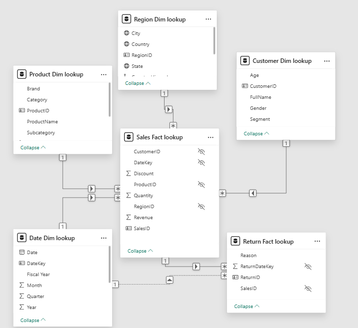
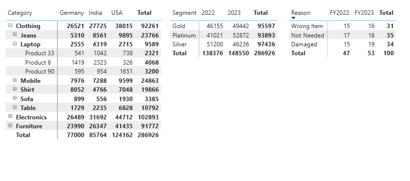

# PR-2: Data Modeler – Power BI Star Schema Project

## 📌 Project Overview
This project is part of an internal Power BI assignment focused on **Data Modeling**, **table relationships**, and **schema design**.  
The goal is to build a **well-structured normalized Star Schema** in Power BI using multiple fact and dimension tables.

> ⚠️ No calculated columns, DAX measures, or charts are used. 
> ✅ Only **Power Query**, **Model View**, and a **Matrix visual** are used for verification.

---

## 🎯 Project Objective
To demonstrate understanding of:
- Table relationships
- Primary Key (PK) and Foreign Key (FK)
- Cardinality (1:Many, Many:1, 1:1)
- Star vs Snowflake schema
- Inactive relationships
- Filter flow and ambiguity handling
- Data categories and hierarchies

---

## 🔗 Dataset Files (Source Data)

All source data files used in this project are provided below:

- 📄 [Sales_Fact.xlsx](./Sales_Fact.xlsx)  
- 📄 [Customer_Dim.xlsx](./Customer_Dim.xlsx)  
- 📄 [Product_Dim.xlsx](./Product_Dim.xlsx)  
- 📄 [Region_Dim.xlsx](./Region_Dim.xlsx)  
- 📄 [Date_Dim.xlsx](./Date_Dim.xlsx)  
- 📄 [Returns_Fact.xlsx](./Returns_Fact.xlsx)

These Excel files were imported into **Power BI using Power Query**, cleaned, and then loaded into the data model for relationship building and schema design.

---

## 🗂 Dataset Overview

### 1. **Sales_Fact**
- SalesID (PK)
- CustomerID (FK)
- ProductID (FK)
- RegionID (FK)
- DateKey (FK)
- Quantity
- Revenue
- Discount

### 2. **Customer_Dim**
- CustomerID (PK)
- FullName
- Age
- Gender
- Segment

### 3. **Product_Dim**
- ProductID (PK)
- ProductName
- Category
- Subcategory
- Brand

### 4. **Region_Dim**
- RegionID (PK)
- Country
- State
- City

### 5. **Date_Dim**
- DateKey (PK)
- Date
- Month
- Quarter
- Year
- Fiscal Year

### 6. **Returns_Fact**
- ReturnID (PK)
- SalesID (FK → Sales_Fact)
- ReturnDateKey (FK → Date_Dim)
- Reason

---

## 🧩 Power BI Model View (Star Schema)

---

## 🔗 Relationships Created

| From Table      | To Table         | Key Mapping                    | Cardinality |
|----------------|------------------|--------------------------------|-------------|
| Sales_Fact     | Customer_Dim     | CustomerID → CustomerID        | Many : One  |
| Sales_Fact     | Product_Dim      | ProductID → ProductID          | Many : One  |
| Sales_Fact     | Region_Dim       | RegionID → RegionID            | Many : One  |
| Sales_Fact     | Date_Dim         | DateKey → DateKey              | Many : One  |
| Returns_Fact   | Sales_Fact       | SalesID → SalesID              | Many : One  |
| Returns_Fact   | Date_Dim         | ReturnDateKey → DateKey        | Inactive    |

✅ Cross-filter direction: **Single**  
✅ Inactive relationship used for return date scenarios

---

## 🧱 Schema Design
- **Star Schema** implemented using `Sales_Fact` as the central table.
- `Returns_Fact` modeled as a **secondary fact table** (Snowflake-like design).
- All dimensions connected directly to the fact table.

---

## 🛠 Data Model Enhancements

### ✅ Data Formatting
- Currency: Revenue
- Whole Numbers: Quantity
- Dates: Date, Fiscal Year

### ✅ Data Categories
- Country → Country/Region  
- State → State  
- City → City  
- ProductName → Product  

### ✅ Hierarchies Created
- **Date_Dim:** Year → Quarter → Month → Date  
- **Region_Dim:** Country → State → City  
- **Product_Dim:** Category → Subcategory → ProductName  

---

## 📊 Report View (Matrix Output)

---

## ✅ Verification Step (Matrix Only)

A **Matrix visual** was used to validate relationship flow:

1. **Sales by Product Category and Region**
2. **Return Reasons by Fiscal Year**
3. **Revenue by Customer Segment**

✔ Drill-down tested on all hierarchies  
✔ Filter flow verified  
✔ No ambiguity or incorrect aggregation observed

---

## 📦 Deliverables
- ✅ Single `.pbix` file containing:
  - Cleaned tables (Power Query)
  - Defined relationships
  - Hierarchies and data categories
  - Matrix table for verification
- ✅ This `README.md` file explaining:
  - Schema type
  - Relationship logic
  - Verification approach
  - Modeling decisions

---

## 🧠 Key Learnings
- Importance of clean PK/FK relationships
- Proper use of inactive relationships
- Avoiding bidirectional filters unless necessary
- Star schema best practices in Power BI

---

### ✅ Author
**Aesha Makrubiya – Data Modeling Team**

